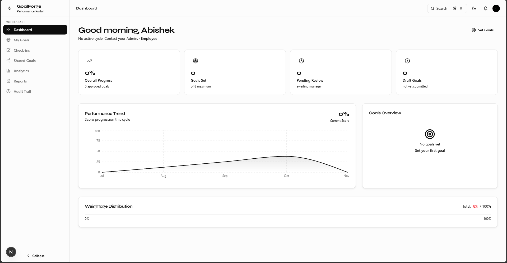
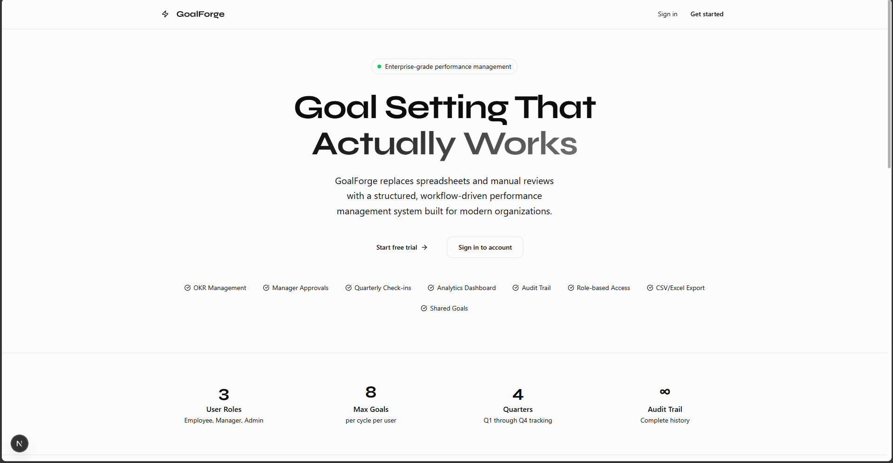
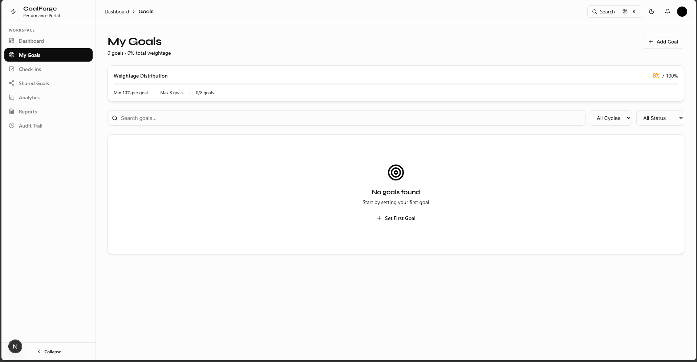
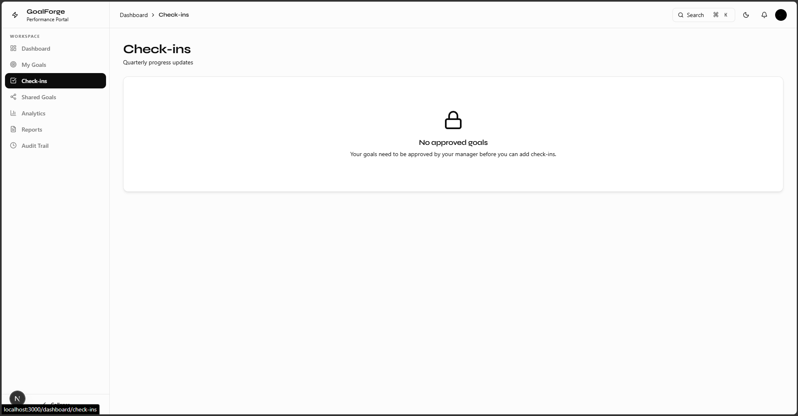
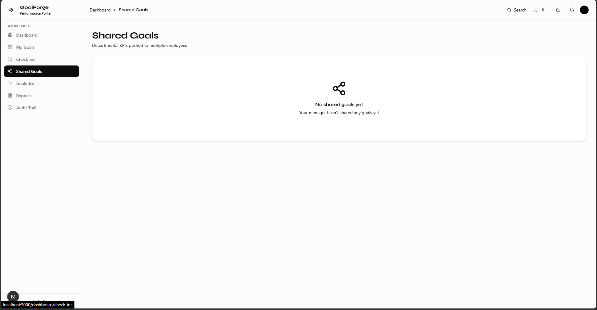
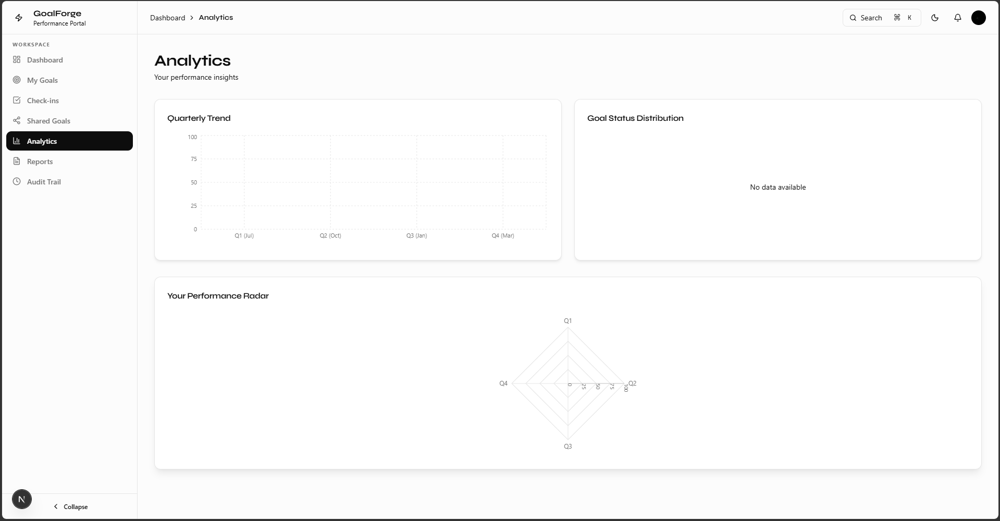
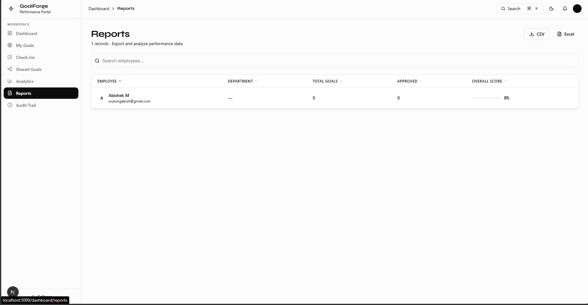
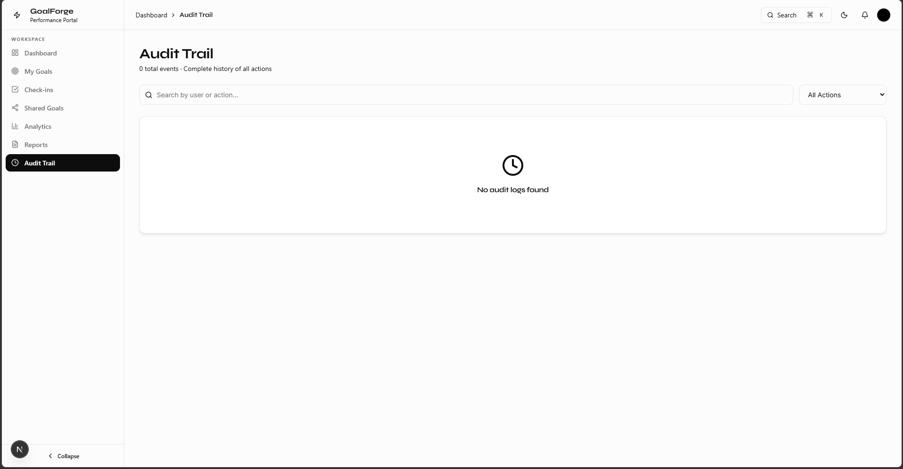

# 🎯 PulseAlign: Enterprise Performance & Goal Management System

<div align="center">
  
</div>

---

## 1. Project Overview

**PulseAlign** is a modern, role-based performance and goal management platform engineered specifically for modern enterprises and built during the **AtomQuest Hackathon**. 

In large organizations, tracking Key Performance Indicators (KPIs), Objectives and Key Results (OKRs), and employee goals is often relegated to disparate spreadsheets, manual email chains, and disconnected HR tools. PulseAlign solves this business problem by providing a centralized, transparent, and strictly governed portal for goal lifecycle management. 

**Enterprise Value:**
- **Productivity Benefits:** Eliminates manual tracking by automating goal submission, manager approval workflows, and quarterly check-ins.
- **Accountability Benefits:** Enforces rigid auditing and locks goals once approved, preventing unauthorized alterations of historical performance data.
- **Reporting Benefits:** Aggregates individual and team-level metrics into real-time analytical dashboards for upper management to assess organizational health.

---

## 2. Core Features Summary

GoalForge is packed with features designed to map directly to corporate hierarchy and compliance workflows.

- **Goal Creation & Management:** Employees can draft goals across specific "Thrust Areas", defining targets, weightages, and Units of Measurement (UoM).
- **Approval Workflow Engine:** Managers receive submissions and can approve, reject, or request rework with inline comments. Once approved, goals are transitioned to a `LOCKED` state.
- **Quarterly Check-ins:** A structured system for reporting achievements at the end of Q1, Q2, Q3, and Q4. 
- **Shared / Cascading Goals:** Managers can push departmental objectives down to multiple employees, linking them as "Child Goals".
- **Role-Based Access Control (RBAC):** Strict separation of concerns between `EMPLOYEE`, `MANAGER`, and `ADMIN`. 
- **Real-Time Analytics:** Dashboards featuring heatmaps, progress rings, and completion metrics.
- **Comprehensive Audit Trail:** Every mutation (creation, edit, approval) is immutably logged with `prevValue` and `newValue` JSON snapshots.

---

## 3. Technology Stack Analysis

<div align="center">
  
</div>

GoalForge leverages a bleeding-edge, serverless-ready tech stack.

- **Frontend Framework:** **Next.js 15+ (App Router & Turbopack)**. Used for optimal Server-Side Rendering (SSR), SEO, and rapid edge delivery.
- **Language:** **TypeScript**. Enforces strict type safety across the entire stack, drastically reducing runtime errors.
- **Styling & UI:** **Tailwind CSS v4** combined with **Framer Motion**. Enables a premium glassmorphic UI with hardware-accelerated micro-animations.
- **Database:** **Neon PostgreSQL**. A serverless Postgres database that scales compute instantly and supports connection pooling for edge environments.
- **ORM:** **Prisma 7.8**. Provides a strictly typed database client and driver adapters (`@prisma/adapter-pg`) tailored for secure SSL connection pooling.
- **Authentication:** **Clerk**. Offloads session management, JWT handling, and identity verification to an enterprise-grade auth provider.
- **State Management:** **Zustand**. A lightweight, unopinionated state manager used for UI state (e.g., Command Palette triggers).

---

## 4. Complete Folder Structure Explanation

```text
C:.
├── prisma/
│   └── schema.prisma         # Database schema, models, and enums
├── public/
│   └── assets/               # Static assets and UI screenshots
└── src/
    ├── app/
    │   ├── (dashboard)/      # Protected dashboard routes (RBAC applied)
    │   │   ├── admin/        # Admin-only panels (cycles, users)
    │   │   ├── analytics/    # Org-wide analytics pages
    │   │   ├── approvals/    # Manager approval pipelines
    │   │   ├── audit/        # Audit trail viewer
    │   │   ├── check-ins/    # Quarterly check-in interfaces
    │   │   ├── goals/        # Personal goal management
    │   │   └── shared-goals/ # Cascaded/linked goals interface
    │   ├── api/              # Next.js Route Handlers (RESTful API)
    │   │   ├── admin/        # User management endpoints
    │   │   ├── goals/        # CRUD and workflow endpoints (submit/approve)
    │   │   └── webhook/      # Clerk webhooks for syncing users
    │   ├── sign-in/          # Clerk authentication routes
    │   ├── globals.css       # Global Tailwind variables and glassmorphic utilities
    │   └── layout.tsx        # Root application layout
    ├── components/
    │   ├── admin/            # Admin UI components
    │   ├── analytics/        # Chart and KPI components
    │   ├── goals/            # Goal modals, tables, and forms
    │   ├── layout/           # Sidebar, Navbar, and Dashboard Shell
    │   └── ui/               # Reusable primitives (Command Palette, Buttons)
    ├── lib/                  # Core utilities
    │   ├── auth.ts           # Clerk-to-Prisma user synchronization
    │   ├── db.ts             # Prisma Client initialization (connection pooling)
    │   └── validations.ts    # Zod schemas for input validation
    └── store/
        └── useAppStore.ts    # Zustand global state (sidebar, palettes)
```
**Architecture Strategy:** The project uses a heavily modular **Feature-Sliced Design**. UI components are localized to their domain (e.g., `components/goals`), while global primitives reside in `components/ui`. APIs are isolated mirroring the UI routes.

---

## 5. UI/UX Architecture

<div align="center">
  
</div>

GoalForge sets a new standard for internal enterprise tools by abandoning the typical "drab corporate dashboard" look in favor of a **Premium Glassmorphic Design**.

- **Glassmorphism:** The app uses heavy `backdrop-blur-2xl`, translucent backgrounds (`bg-white/70`), and subtle borders to create depth and visual hierarchy. 
- **Command Palette (`⌘K`):** A universally accessible frosted-glass search modal allows power users to instantly navigate across the portal without touching a mouse.
- **Animations:** Powered by Framer Motion, every layout shift, modal open, and hover state features smooth, physics-based transitions (`easeOut`).
- **Dark/Light Mode:** Built natively into the Tailwind architecture via CSS variables.

---

## 6. Authentication & Authorization Flow

GoalForge uses **Clerk** for robust identity management.

1. **Signup/Login Flow:** Users authenticate via Clerk's hosted UI or OAuth providers.
2. **Webhook Sync:** Upon successful registration, Clerk fires a webhook to `/api/webhook/clerk`. GoalForge intercepts this and uses `upsert` in Prisma to synchronize the user profile into the Postgres database.
3. **Session Handling:** Next.js middleware verifies the Clerk JWT on every request. If the token is invalid, the user is redirected to `/sign-in`.
4. **Role-Based Routing:** 
   - `EMPLOYEE` can access `/goals` and `/check-ins`.
   - `MANAGER` gains access to `/approvals` and `/shared-goals`.
   - `ADMIN` gains access to `/admin/cycles` and `/admin/users`.
   APIs identically verify roles on the server-side before executing mutations.

---

## 7. Database Schema Analysis

The database is highly relational, enforcing strict referential integrity.

- **User (`users`)**: Stores identity and hierarchy (`managerId` self-relation).
- **Cycle (`cycles`)**: Defines performance periods (e.g., "FY 2026"). Ensures goals are attached to valid financial years.
- **Goal (`goals`)**: The core entity. Tracks targets, weightages, metrics (`UoM`), and state (`GoalStatus`). Includes a `parentGoalId` for cascading goals.
- **CheckIn (`check_ins`)**: Tracks quarterly progress. Enforces uniqueness constraint `@@unique([goalId, quarter])` to prevent duplicate check-ins per quarter.
- **AuditLog (`audit_logs`)**: Immutable ledger. Stores action type, actor (`userId`), and payload diffs (`prevValue`, `newValue`).
- **Notification (`notifications`)**: Ephemeral alerts for goal approvals and deadlines.

---

## 8. Goal Lifecycle Workflow

<div align="center">
  
</div>

1. **Drafting:** Employee creates a goal (`STATUS = DRAFT`).
2. **Submission:** Employee finalizes metrics and clicks Submit (`STATUS = SUBMITTED`).
3. **Manager Review:** The goal appears in the Manager's `/approvals` queue.
   - *Reject/Rework:* Manager leaves a comment; goal returns to employee (`STATUS = REWORK`).
   - *Approve:* Manager approves the goal. **Crucially, the status becomes `LOCKED`.**
4. **Execution:** Once `LOCKED`, core fields (Target, Weightage) can no longer be edited by the employee. The system opens the Quarterly Check-in windows.
5. **Admin Override:** If business objectives shift mid-year, only an `ADMIN` can unlock a goal.

---

## 9. Validation Rules & Business Logic

- **Weightage Validation:** A user's total active goal weightage cannot exceed `100%` within a given `Cycle`.
- **UoM Constraints:** If UoM is `PERCENTAGE`, the target must be `<= 100`.
- **Lock Enforcement:** API routes (`/api/goals/[id]`) explicitly block `PUT/PATCH` requests on core fields if the status is `LOCKED` or `APPROVED`.
- **Quarterly Strictness:** Employees cannot submit a Q2 check-in if Q1 is incomplete or if the Q2 chronological window hasn't opened (configurable by Admin).

---

## 10. Shared Goals System

<div align="center">
  
</div>

To align departments, Managers can create **Shared Goals**.
- A manager defines a primary objective (e.g., "Increase Q3 Revenue by 10%").
- They tag specific employees. The system clones this goal, linking the clones to the manager's goal via `parentGoalId` and marking `isShared = true`.
- Employees cannot alter the title or target of a shared goal; they can only update their personal check-in progress against it.

---

## 11. Quarterly Check-In System

The Check-in system breaks annual goals into actionable updates.
- **Workflow:** At the end of a quarter (Q1-Q4), employees submit their `achievement` metric.
- **Progress Calculation:** The backend compares the `achievement` against the `target`. If `isLowerBetter` is true (e.g., "Reduce server crashes"), the math inverts to calculate the `progressScore`.
- **Manager Feedback:** Managers review the check-in and append `managerComment`s, providing continuous performance feedback.

---

## 12. Analytics & Dashboard System

<div align="center">
  
</div>

The `/analytics` route pulls aggregated data for managers and admins.
- **KPI Cards:** Total Goals, Org Completion Rate, Pending Approvals.
- **Visualizations:** Generates calculated progress rings and heatmaps based on normalized `progressScore`s across the entire department.
- **Data Flow:** The `/api/analytics` endpoint executes complex Prisma aggregations, factoring in goal weightages to produce a true weighted-average completion score for the organization.

---

## 13. Reporting & Export System

<div align="center">
  
</div>

The reporting engine allows HR and Admins to extract compliance data.
- **Functionality:** Users can filter goals by Cycle, Department, Manager, or Status.
- **Export:** Frontend utilities convert the JSON data payload into formatted `.csv` files for Excel consumption, vital for enterprise performance review meetings.

---

## 14. Audit Trail System

<div align="center">
  
</div>

Governance is a primary requirement for enterprise SaaS. GoalForge's Audit Trail ensures absolute accountability.
- Whenever an API mutates a goal (Create, Update, Approve), a Prisma transaction is used.
- The transaction simultaneously writes an `AuditLog` record containing the exact timestamp, the user executing the request, and JSON diffs of the changes.
- **Admin Visibility:** The `/audit` route provides a chronological, searchable ledger of every action taken in the system.

---

## 15. API Architecture

GoalForge uses Next.js Route Handlers as a stateless REST-like API.
- **Middleware:** `auth()` from Clerk is called at the top of every route to verify identity.
- **Validation:** Payloads are parsed using Zod schemas (`src/lib/validations.ts`) before touching the database.
- **Error Handling:** Standardized `NextResponse.json({ error: "..." }, { status: 400 })` returns are utilized.
- **Example Endpoint (`/api/goals/[id]/approve`)**: Verifies the caller is the assigned manager, updates the `GoalStatus` to `APPROVED`/`LOCKED`, triggers an Audit Log creation, and returns 200 OK.

---

## 16. State Management & Data Flow

- **Server State:** Handled natively by Next.js Server Components. Pages fetch data directly from Prisma on the server, avoiding client-side loading spinners and improving SEO/performance.
- **Client State:** Zustand (`useAppStore.ts`) manages ephemeral UI state, such as whether the Command Palette (`commandPaletteOpen`) or Sidebar is expanded, allowing disparate components to communicate instantly without prop-drilling.

---

## 17. Security Architecture

- **Postgres SSL:** The connection pool enforces SSL communication natively (`rejectUnauthorized: false` for strict serverless environments).
- **Injection Prevention:** Prisma ORM automatically sanitizes all inputs, negating SQL injection risks.
- **XSS Prevention:** React natively escapes all interpolated strings in the UI.
- **Route Protection:** Handled at two layers—Next.js Middleware protects page assets, and Route Handlers protect API data.

---

## 18. Performance Optimization

- **Turbopack:** Utilized for lightning-fast local development and HMR.
- **Server Components:** By pushing Prisma queries to Server Components, JavaScript bundle sizes sent to the client are drastically minimized.
- **Database Indexing:** Prisma schema utilizes implicit and explicit relations to optimize join queries (e.g., eagerly loading `user` data when fetching `goals`).

---

## 19. Deployment & Hosting Architecture

GoalForge is architected for Vercel and Edge networks.
- **Frontend/Backend Hosting:** Vercel. Seamlessly handles Next.js App Router, automatically provisioning serverless functions for the `/api` routes.
- **Database Hosting:** Neon Serverless Postgres. The database compute scales to zero during inactivity and instantly spins up, making it highly cost-effective while maintaining enterprise availability.

---

## 20. How To Use The Project

### Employee Guide
1. **Login:** Authenticate via the portal.
2. **Draft Goals:** Navigate to **My Goals**. Click "New Goal". Select a cycle, define your target and weightage.
3. **Submit:** Once drafted, select the goals and click "Submit to Manager".
4. **Check-ins:** At quarter-end, visit **Check-ins**, select your active goals, and log your numerical achievements.

### Manager Guide
1. **Approvals:** Check the **Approvals** tab for pending goals from your direct reports. Review, leave comments, and Approve (locking them).
2. **Shared Goals:** Navigate to **Shared Goals** to cascade new targets down to your team.
3. **Monitor:** Use the **Analytics** tab to view your team's aggregated progress.

### Admin Guide
1. **Cycles:** Navigate to **Settings > Cycles** to open new financial periods.
2. **Audit:** Monitor organizational compliance via the **Audit Trail**.

---

## 21. End-to-End User Journey

**The Performance Review Cycle:**
1. *Admin* opens the "FY 2026" Cycle.
2. *Manager* creates a Shared Goal: "Achieve 99% Uptime", assigning it to 3 DevOps engineers.
3. *Employee* logs in, sees the cascaded goal, and adds two personal goals. They submit all to the Manager.
4. *Manager* reviews, requests a rework on one goal's weightage, and approves the rest. The approved goals are locked.
5. Three months later, *Employee* logs their Q1 Check-in.
6. *Admin* runs a Q1 Org-wide Report, exporting the data to CSV to present to the Board of Directors, while reviewing the Audit Trail to ensure no targets were manipulated post-approval.

---

## 22. Enterprise Value & Real-World Usage

GoalForge is a production-ready blueprint for HR tech. Real companies can deploy this to:
- Enforce strict accountability metrics.
- Maintain a transparent, immutable record of employee promises vs. deliveries.
- Standardize performance reviews across disparate global departments.
- Replace fragile Excel sheets with a robust, scalable, and visually impressive web application.

---

## 23. Strengths of the Project

- **Visual Excellence:** The glassmorphic design and micro-animations provide a consumer-grade UX in a B2B context.
- **Robust Architecture:** The combination of Next.js, Prisma, and Neon guarantees extreme scalability and maintainability.
- **Data Integrity:** The rigid state machine (Draft -> Submitted -> Approved -> Locked) prevents data tampering.

---

## 24. Possible Future Improvements

- **Microsoft Teams / Slack Integration:** Send notifications directly to corporate chat when goals require approval.
- **AI Insights:** Integrate an LLM to analyze employee check-in comments and predict goal failure risks.
- **SSO Integration:** Expand Clerk to support enterprise SAML/Okta single sign-on.
- **Dynamic Check-in Intervals:** Allow goals to have monthly or bi-weekly check-in schedules instead of strictly quarterly.

---

## 25. Deployment to Vercel

1. Create a GitHub repository for `PulseAlign` and push the project.
2. Import the repository into Vercel and choose the `PulseAlign` project.
3. Set the required environment variables in Vercel:
   - `DATABASE_URL`
   - Clerk credentials from your Clerk dashboard (e.g. `CLERK_FRONTEND_API`, `CLERK_SECRET_KEY`, `CLERK_JWT_KEY`, etc.)
4. Use the default build command:
   - `npm run build`
5. Vercel will automatically detect this as a Next.js project and deploy it.

> Make sure you do not commit `.env` or any local secret keys. The `.vercelignore` file already excludes `.env*` and `.clerk`.

## 26. Final Technical Conclusion

**PulseAlign** represents the pinnacle of modern web development applied to enterprise utility. By leveraging the Next.js App Router for optimal rendering, Prisma for rigorous type-safe data access, and an immaculately crafted glassmorphic UI, it transcends standard hackathon projects. It is a highly scalable, secure, and production-ready SaaS platform that delivers immediate organizational value, transparency, and operational efficiency. 

---
*Developed for the AtomQuest Hackathon.*
